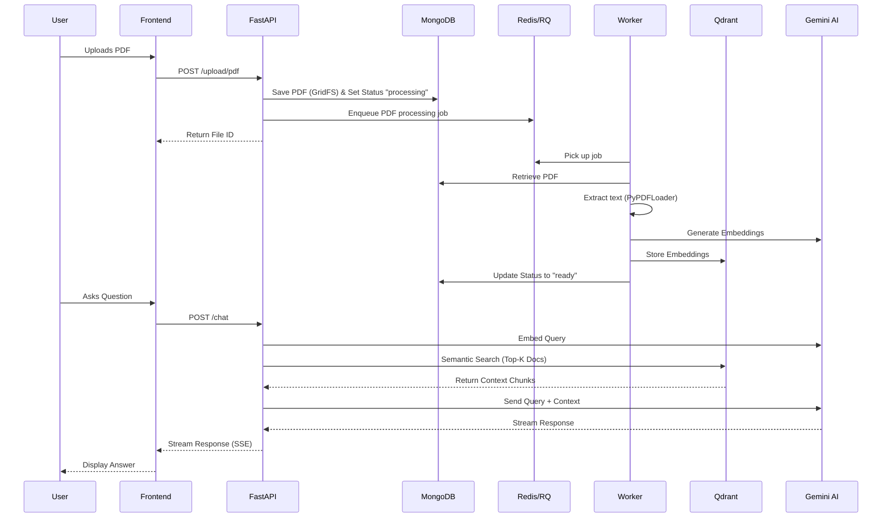

# GP-RAG: Generative PDF RAG Application

GP-RAG is a full-stack Retrieval-Augmented Generation (RAG) application that allows users to upload PDF documents and intelligently chat with their content. The system extracts text from the PDFs, generates embeddings, stores them in a vector database, and uses advanced Language Models to answer user questions based on the document's context.

## 🌟 What is the project?
This project is an end-to-end RAG system designed for seamless document interaction. It provides a modern web interface for users to upload files and ask natural language questions about those files. The backend asynchronously processes these documents, breaking them down into vectors so that when a user asks a question, the system retrieves only the most relevant sections of the document to formulate an accurate and context-aware answer using Google's Gemini models.

## ⚙️ How is the project working?
1. **Upload & Storage**: The user uploads a PDF via the Next.js frontend. The FastAPI backend receives the file and securely stores it in a MongoDB database (using GridFS) while marking its status as "processing".
2. **Asynchronous Processing**: A background task is queued using Redis and RQ. A separate Python worker picks up this job.
3. **Embedding Generation**: The worker extracts text from the PDF using Langchain's `PyPDFLoader`, generates vector embeddings using Google Generative AI (`text-embedding-004`), and stores these embeddings in Qdrant (a vector database). The document's status in MongoDB is then updated to "ready".
4. **Contextual Chat**: When the user submits a question, the backend converts the query into an embedding, searches Qdrant for the top most relevant document chunks, and passes both the user's query and the retrieved context to the Gemini LLM (`gemini-2.0-flash`).
5. **Real-time Streaming**: The LLM streams the answer back to the frontend in real-time via Server-Sent Events (SSE), along with citation metadata.

## 🏗️ Architecture
The architecture is split into a robust frontend client and a high-performance Python server:

- **Frontend (Client)**: Built with Next.js 15, React, and Tailwind CSS. It handles user authentication, file uploads, and the real-time chat interface.
- **Backend Server (Server_Python)**: A FastAPI application responsible for orchestrating the API endpoints, database interactions, and LLM queries.
- **Background Worker**: A standalone Python process (managed via RQ and Redis) that offloads the heavy lifting of PDF parsing and embedding generation, ensuring the main API remains responsive.
- **Databases**:
  - **MongoDB (GridFS)**: Stores raw PDF files and metadata (document processing status).
  - **Redis**: Acts as the message broker for the background job queue.
  - **Qdrant**: The Vector Database that stores document embeddings for fast semantic search.

## 🔄 Workflow


## 🛠️ Technology Stack & Why

### Frontend
- **Next.js (v15)**: Provides an excellent React framework with Server Components, optimized rendering, and easy API route integration.
- **Tailwind CSS**: A utility-first CSS framework for rapidly building custom, responsive UI designs without leaving HTML/JSX.
- **Clerk**: Comprehensive user authentication and management, completely abstracting away auth complexities.
- **React Markdown**: Used to safely and cleanly render the Markdown responses generated by the LLM.

### Backend
- **FastAPI**: A modern, fast web framework for building APIs with Python. Chosen for its performance, asynchronous capabilities, and automatic OpenAPI documentation.
- **Langchain**: The industry-standard framework for developing applications powered by language models. It standardizes document loading, vector storage interaction, and LLM pipelines.
- **Google Generative AI (Gemini)**: Used for both embeddings (`text-embedding-004`) and chat (`gemini-2.0-flash`), providing state-of-the-art accuracy and speed.
- **RQ (Redis Queue)**: A lightweight Python library for queueing jobs and processing them in the background, essential for handling large PDF files without blocking API requests.
- **SSE (Server-Sent Events)**: Using `sse-starlette` to stream LLM tokens directly to the client as they are generated, providing a snappy ChatGPT-like user experience.

### Databases
- **MongoDB (GridFS)**: Perfect for storing large files (like PDFs) that exceed standard BSON document size limits while allowing metadata queries.
- **Qdrant**: An open-source vector search engine chosen for its high performance, rich filtering capabilities, and ease of use in Langchain.
- **Redis**: The most robust choice as an in-memory datastore acting as a message broker for RQ background tasks.

## 🚀 Getting Started

### Prerequisites
- Node.js & npm/pnpm
- Python 3.9+
- MongoDB instance
- Redis server
- Qdrant instance

### 1. Client Setup
```bash
cd client
pnpm install
# Create .env.local with your Clerk API keys
pnpm run dev
```

### 2. Server Setup
```bash
cd server_python
python -m venv venv
source venv/bin/activate  # On Windows: venv\Scripts\activate
pip install -r requirements.txt
# Configure your .env file with API keys and database URLs
uvicorn main:app --reload
```

### 3. Worker Setup
In a new terminal window (with the python virtual environment activated):
```bash
cd server_python
python worker.py
```
